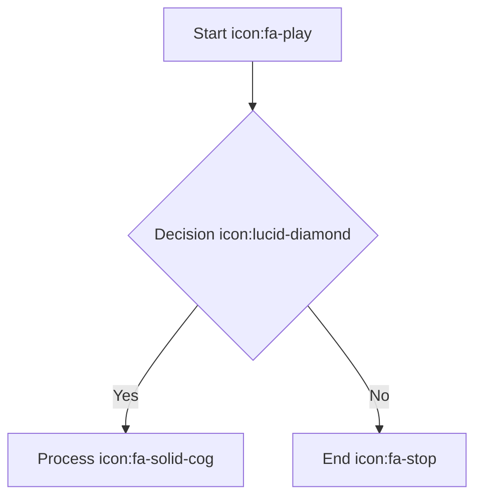
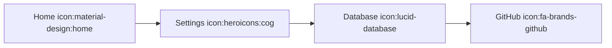
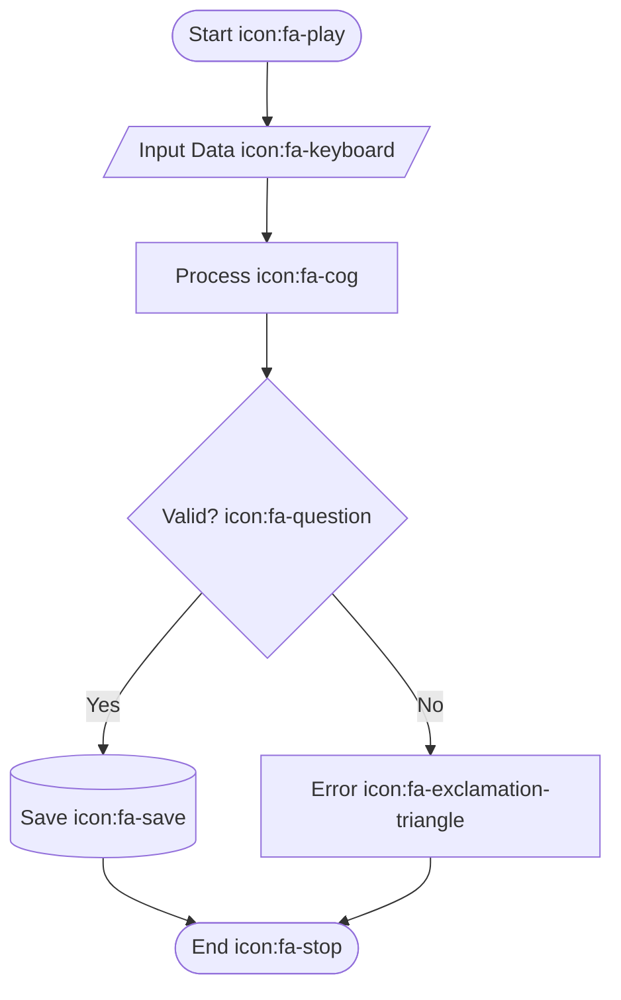

# Icon Support Documentation

## Overview
The Mermaid MCP Server now includes comprehensive icon support, enabling the use of thousands of icons from multiple sources in your Mermaid diagrams. This includes LucidChart-compatible icons, FontAwesome icons, Iconify collections, and custom icons.

## Supported Icon Sources

### 1. FontAwesome Icons
- **Total Icons**: 33,000+ icons
- **Styles**: Solid, Regular, Brands (Free), Light, Thin, Duotone (Pro)
- **Usage**: `icon:fa-home`, `icon:fa-solid-server`, `icon:fa-brands-github`

### 2. Iconify Collections
- **Total Icons**: 200,000+ icons
- **Collections**: Material Design, Heroicons, Lucide, and many more
- **Usage**: `icon:material-design:home`, `icon:heroicons:cog`

### 3. LucidChart Compatible
- **Built-in Icons**: Server, Database, Disk, Cloud, Internet
- **Usage**: `icon:lucid-server`, `icon:lucid-database`

### 4. Custom Icons
- **User-uploaded SVG icons**
- **Usage**: `icon:custom-myicon`

## Icon Syntax

### Basic Syntax


### Advanced Syntax


### Mixed Sources


## Available MCP Tools

The server now provides additional tools for icon management:

### 1. `search_icons`
Search for icons across all sources.

**Parameters:**
- `query` (optional): Search term
- `categories` (optional): Filter by categories
- `sources` (optional): Filter by icon sources
- `styles` (optional): Filter by icon styles
- `limit` (optional): Maximum results (default: 50)
- `offset` (optional): Pagination offset

**Example:**
```json
{
  "name": "search_icons",
  "arguments": {
    "query": "home",
    "sources": ["fontawesome", "iconify"],
    "limit": 10
  }
}
```

### 2. `get_icon`
Get a specific icon by ID.

**Parameters:**
- `iconId` (required): The unique icon ID

**Example:**
```json
{
  "name": "get_icon",
  "arguments": {
    "iconId": "fa-solid-home"
  }
}
```

### 3. `list_categories`
List all available icon categories.

**Example:**
```json
{
  "name": "list_categories",
  "arguments": {}
}
```

### 4. `list_themes`
List available themes and orientations.

**Example:**
```json
{
  "name": "list_themes",
  "arguments": {}
}
```

### 5. `icon_stats`
Get statistics about the icon system.

**Example:**
```json
{
  "name": "icon_stats",
  "arguments": {}
}
```

## Icon Integration Examples

### Architecture Diagrams


### Flowcharts


### Network Diagrams

```mermaid
graph TB
    Internet[Internet icon:fa-globe] --> Router[Router icon:lucid-router]
    Router --> Switch[Switch icon:lucid-switch]
    Switch --> Server1[Web Server icon:fa-server]
    Switch --> Server2[DB Server icon:fa-database]
    Switch --> Server3[File Server icon:lucid-disk]
```


## Configuration

### Icon Sources Configuration
```typescript
const iconConfig = {
  iconSources: [
    {
      name: 'fontawesome',
      type: 'fontawesome',
      enabled: true,
      styles: ['solid', 'regular', 'brands'],
      apiKey: process.env.FONTAWESOME_API_KEY // Optional for Pro
    },
    {
      name: 'iconify',
      type: 'iconify',
      enabled: true,
      collections: ['material-design-icons', 'heroicons', 'lucide']
    },
    {
      name: 'lucidchart',
      type: 'lucidchart',
      enabled: true
    },
    {
      name: 'custom',
      type: 'custom',
      enabled: true,
      localPath: './custom-icons'
    }
  ]
};
```

### Performance Settings
```typescript
const performanceConfig = {
  caching: {
    enabled: true,
    maxSize: '100MB',
    ttl: '24h'
  },
  loading: {
    preloadCommon: true,
    lazyLoad: true,
    timeout: 5000
  }
};
```

## Performance Optimization

### Icon Caching
- Icons are cached after first load
- Cache persists between server restarts
- Configurable cache size and TTL

### Lazy Loading
- Icons loaded only when referenced in diagrams
- Reduces startup time and memory usage

### Fallback System
- Built-in fallback icons when external sources fail
- Graceful degradation for missing icons

## Troubleshooting

### Common Issues

#### Icon Not Found
```
Icon not found: fa-nonexistent
```
**Solution**: Check icon name and ensure the source is enabled.

#### Slow Icon Loading
```
Icon integration failed: timeout
```
**Solution**: Check network connectivity and increase timeout settings.

#### Memory Issues
```
Out of memory error
```
**Solution**: Reduce cache size or disable unused icon sources.

### Debug Commands

#### Check Icon System Status
```bash
npm run test:icons
```

#### Validate Configuration
```bash
node -e "console.log(require('./dist/icons/manifest.json'))"
```

#### Test Specific Icon
```bash
echo '{"query": "home", "sources": ["fontawesome"]}' | \
  node -e "
    const { IconManager } = require('./dist/src/icons/IconManager.js');
    const config = require('./dist/src/icons/config.js');
    const manager = new IconManager(config);
    manager.loadIcons().then(() => {
      const stdin = process.stdin;
      stdin.on('data', async (data) => {
        const query = JSON.parse(data.toString());
        const result = await manager.searchIcons(query);
        console.log(JSON.stringify(result, null, 2));
      });
    });
  "
```

## API Reference

### IconDefinition Interface
```typescript
interface IconDefinition {
  id: string;           // Unique identifier
  name: string;         // Human-readable name
  category: string;     // Icon category
  tags: string[];       // Search tags
  svg: string;          // SVG content
  styles?: string[];    // Available styles
  orientations?: string[]; // Available orientations
  source: string;       // Source name
  license?: string;     // License information
  attribution?: string; // Attribution requirements
}
```

### IconSearchOptions Interface
```typescript
interface IconSearchOptions {
  query?: string;       // Search query
  categories?: string[]; // Category filters
  sources?: string[];   // Source filters
  styles?: string[];    // Style filters
  limit?: number;       // Result limit
  offset?: number;      // Pagination offset
}
```

### IconSearchResult Interface
```typescript
interface IconSearchResult {
  icons: IconDefinition[];
  total: number;
  hasMore: boolean;
  query: IconSearchOptions;
}
```

## Best Practices

### Icon Naming
- Use descriptive, consistent naming
- Prefer semantic names over decorative ones
- Consider internationalization

### Performance
- Limit icons per diagram to avoid performance issues
- Use caching for frequently used icons
- Consider icon size and complexity

### Accessibility
- Provide alternative text for icons
- Ensure sufficient color contrast
- Test with screen readers

### Maintenance
- Regularly update icon libraries
- Monitor cache usage and performance
- Keep track of icon usage statistics

## Migration Guide

### From Basic Mermaid
1. Update diagram syntax to include icon references
2. Test with new icon tools
3. Optimize for performance if needed

### From External Icon Systems
1. Map existing icon references to new syntax
2. Update build processes
3. Validate icon availability

## Support

### Getting Help
- Check the troubleshooting section
- Review error messages and logs
- Test with simpler icon references

### Reporting Issues
Include the following information:
- Icon syntax used
- Error messages
- Server configuration
- Network connectivity status

### Contributing
- Submit new icon sources
- Report missing icons
- Suggest performance improvements
- Contribute to documentation

This comprehensive icon support transforms the Mermaid MCP Server into a powerful diagramming tool with access to hundreds of thousands of professional icons from multiple sources.